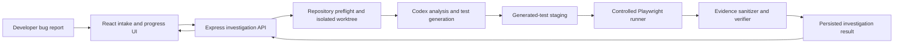

# FailSpec

FailSpec turns a bug report for a trusted local React or Next.js repository into one evidence-backed Playwright regression test. It is built for the moment when a report says “this is broken,” but the team needs a reproducible failure before changing code.

The MVP is deliberately local-first. It does not upload the submitted repository or execute arbitrary remote code.

FailSpec was created during OpenAI Build Week 2026 using OpenAI Codex and GPT-5.6.

## What it does

1. Collects the reported and expected behaviour.
2. Preflights a trusted local repository and creates an isolated Git worktree.
3. Uses Codex to inspect the repository, form a reproduction hypothesis, and generate one constrained Playwright test.
4. Stages and runs that test through a controlled runner.
5. Stores sanitized execution evidence and returns a deterministic verdict: verified, partial evidence, not reproduced, or execution error.

## Judge Quick Start

The fastest way to review FailSpec is deterministic mock mode. It does not require Codex authentication, Git worktree creation, or Playwright browser execution.

Run the following commands from the FailSpec repository root.

### 1. Install dependencies

```bash
npm ci
```

### 2. Start the API

macOS or Linux:

```bash
FAILSPEC_CODEX_MODE=mock npm run dev:server
```

Windows PowerShell:

```powershell
$env:FAILSPEC_CODEX_MODE = "mock"
npm.cmd run dev:server
```

### 3. Start the frontend in a second terminal

macOS or Linux:

```bash
npm run dev:web
```

Windows PowerShell:

```powershell
npm.cmd run dev:web
```

### 4. Submit the included demonstration

Open the Vite URL printed in the terminal, normally:

```text
http://localhost:5173
```

Provide the absolute path to:

```text
fixtures/buggy-checkout-app
```

Use the bug report in:

[`fixtures/buggy-checkout-app/bug-report.md`](fixtures/buggy-checkout-app/bug-report.md)

The mock investigation should complete with a deterministic result showing the investigation timeline, reproduction hypothesis, execution evidence, and verification verdict.

Mock mode demonstrates the product flow but does not run Git preflight, Codex, generated-test staging, or Playwright.

## Architecture



The model proposes how to reproduce the failure, but it does not grade its own work. Final verification is performed by deterministic classification logic operating on sanitized execution evidence.

## Requirements

### Mock mode

- Node.js `^20.19.0` or `>=22.12.0`
- npm

### Real local investigations

Real local mode additionally requires:

- Git
- An installed and authenticated OpenAI Codex CLI
- A trusted, clean local Git repository
- A supported React or Next.js project
- Playwright configured in the submitted repository
- Chromium installed for Playwright execution

FailSpec can be explored on macOS, Linux, or Windows wherever these requirements are available.

The built-in mock mode requires no Codex installation and is the fastest way to review the UI and API flow.

## Install and run

From a clean FailSpec checkout:

```bash
npm ci
```

Start the server:

```bash
npm run dev:server
```

In a second terminal, start the frontend:

```bash
npm run dev:web
```

On Windows PowerShell, use:

```powershell
npm.cmd run dev:server
```

and, in a second terminal:

```powershell
npm.cmd run dev:web
```

Open the Vite URL printed by the web server, normally:

```text
http://localhost:5173
```

## Run modes

### Mock mode

Mock mode is the default. It demonstrates the investigation lifecycle without Git preflight, Codex, generated-test staging, or Playwright execution.

Set it explicitly on macOS or Linux:

```bash
FAILSPEC_CODEX_MODE=mock npm run dev:server
```

On Windows PowerShell:

```powershell
$env:FAILSPEC_CODEX_MODE = "mock"
npm.cmd run dev:server
```

### Real local mode

Install the Playwright Chromium browser before running a real investigation:

```bash
npx playwright install chromium
```

Start the server in local mode on macOS or Linux:

```bash
FAILSPEC_CODEX_MODE=local npm run dev:server
```

On Windows PowerShell:

```powershell
$env:FAILSPEC_CODEX_MODE = "local"
npm.cmd run dev:server
```

Start the frontend in a second terminal:

```bash
npm run dev:web
```

On Windows PowerShell:

```powershell
npm.cmd run dev:web
```

Local mode is only for trusted local repositories. It:

1. Performs repository preflight.
2. Creates a FailSpec-owned isolated Git worktree.
3. Uses Codex to analyze the repository and propose one generated test.
4. Stages the test through a constrained validation boundary.
5. Executes it through the controlled Playwright runner.
6. Collects and sanitizes execution evidence.
7. Cleans up the investigation worktree.
8. Produces a deterministic verification verdict.

The submitted repository is not modified directly. The generated test exists only inside the isolated investigation worktree.

## Try the included sample

The repository includes `fixtures/buggy-checkout-app`, an intentionally broken checkout application.

Its bug report is available at:

[`fixtures/buggy-checkout-app/bug-report.md`](fixtures/buggy-checkout-app/bug-report.md)

The reported failure is that selecting quantity `2` still produces a `$12.00` charge instead of `$24.00`.

Do not submit the tracked fixture directly in real local mode. Create a clean temporary copy, initialise and commit it as a local Git repository, install its dependencies, and then submit that temporary path through FailSpec.

The complete walkthrough, including fixture preparation, reference testing, local execution, and cleanup, is available in:

[`docs/demo-script.md`](docs/demo-script.md)

For a deterministic repository-wide smoke check that does not call the Codex CLI or launch a browser:

```bash
npm run smoke
```

On Windows PowerShell:

```powershell
npm.cmd run smoke
```

## Verification

Run the repository validation suite:

```bash
npm run lint
npm run typecheck
npm test
npm run build
```

On Windows PowerShell:

```powershell
npm.cmd run lint
npm.cmd run typecheck
npm.cmd test
npm.cmd run build
```

The test suite covers:

- Typed shared contracts
- Investigation lifecycle transitions
- Codex structured-output validation
- Generated-test policy enforcement
- Controlled execution and evidence collection
- Deterministic verification classification
- Result rendering
- The fixture smoke workflow

## Architecture and repository layout

- `apps/web`: React and Vite intake, progress, and results UI.
- `apps/server`: Express API, runtime dependency construction, Codex boundary, repository preparation, staging, controlled execution, and persistence.
- `packages/contracts`: Shared request, lifecycle, evidence, and result types.
- `packages/core`: Deterministic lifecycle and verification logic.
- `fixtures/buggy-checkout-app`: Disposable demo fixture and manually authored reference Playwright test.

See [`docs/codex-workflow.md`](docs/codex-workflow.md) for the constrained generated-test contract and [`docs/decisions.md`](docs/decisions.md) for the MVP architecture decisions and boundaries.

## How Codex and GPT-5.6 were used

FailSpec was developed with OpenAI Codex as a pair-programming collaborator.

Codex accelerated the project by helping the team:

- Explore the monorepo and trace investigation lifecycle boundaries.
- Implement narrowly scoped backend, frontend, runner, and verification changes.
- Build strict validation for structured Codex output.
- Create positive, negative, and adversarial tests for the constrained generated-test grammar.
- Run focused and repository-wide verification.
- Diagnose cross-platform execution behaviour, including Windows npm process launching.
- Review documentation and keep implementation details aligned with the architecture.

GPT-5.6 was used within the Codex workflow for technical reasoning, debugging, architecture discussion, classifier-policy analysis, and documentation iteration.

The team remained responsible for the key product and engineering decisions, including:

- Choosing a local-first architecture.
- Running investigations inside isolated Git worktrees.
- Separating model reasoning from deterministic verdict classification.
- Constraining generated Playwright tests instead of permitting arbitrary execution.
- Refusing to treat every generated test failure or non-zero exit code as proof that a bug was reproduced.

Codex does not automatically modify the submitted source repository, fix the reported bug, create a pull request, or determine the final verdict.

## MVP boundaries

- Trusted local React or Next.js repositories only.
- One generated Playwright regression test per investigation.
- No hosted SaaS, authentication, team accounts, GitHub OAuth, or automatic bug fixes.
- A generated test failure or non-zero process exit alone is not proof of a reproduced bug.
- A `verified` verdict requires structured assertion evidence tied to the staged generated test and reproduction hypothesis.
- When that evidence is insufficient, FailSpec returns partial evidence, not reproduced, or execution error according to the observed execution facts.

Runtime investigation records are stored locally under:

```text
.failspec/investigations/
```

Scheduled work is currently in-process only. Restarting the server does not recover an in-flight investigation.
