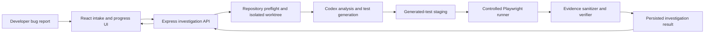

# FailSpec

FailSpec turns a bug report for a trusted local React or Next.js repository into one evidence-backed Playwright regression test. It is built for the moment when a report says "this is broken" but the team needs a reproducible failure before changing code.

The MVP is deliberately local-first. It does not upload a repository or execute arbitrary remote code.

## What it does

1. Collects the reported and expected behaviour.
2. Preflights a trusted local repository and creates an isolated Git worktree.
3. Uses Codex to inspect the repository, form a reproduction hypothesis, and generate one constrained Playwright test.
4. Stages and runs that test through a controlled runner.
5. Stores sanitized execution evidence and returns a deterministic verdict: verified, partial evidence, not reproduced, or execution error.



## Requirements

- Node.js `^20.19.0` or `>=22.12.0`
- npm
- For a real local investigation: an installed, authenticated Codex CLI and a trusted, clean Git repository that uses React or Next.js with Playwright configured

FailSpec can be explored on macOS, Linux, or Windows anywhere the above requirements are available. The built-in mock mode needs no Codex installation and is the fastest way to review the UI and API flow.

## Install and run

From a clean checkout:

```bash
npm ci
npm run dev:server
```

In a second terminal:

```bash
npm run dev:web
```

Open the Vite URL printed by the web server, normally `http://localhost:5173`.

### Run modes

Mock mode is the default. It demonstrates the investigation flow without Git preflight, Codex, generated-test staging, or Playwright execution.

To set mock mode explicitly:

```bash
FAILSPEC_CODEX_MODE=mock npm run dev:server
```

For a real local investigation, start the server in local mode:

```bash
FAILSPEC_CODEX_MODE=local npm run dev:server
```

In Windows PowerShell, set the variable first:

```powershell
$env:FAILSPEC_CODEX_MODE = "local"
npm run dev:server
```

Local mode is only for trusted local repositories. It runs preflight, creates a FailSpec-owned isolated worktree, asks Codex for analysis and one generated test, runs the test through the controlled runner, cleans up its worktree, and classifies the resulting sanitized evidence.

## Try the included sample

The repository includes `fixtures/buggy-checkout-app`, an intentionally broken checkout application. Its bug report is in [fixtures/buggy-checkout-app/bug-report.md](fixtures/buggy-checkout-app/bug-report.md): selecting quantity `2` still produces a `$12.00` charge instead of `$24.00`.

Do not submit the tracked fixture directly in local mode. Create a clean temporary copy, initialise and commit it as a local Git repository, install its dependencies, then submit that temporary path in FailSpec. The complete safe walkthrough, including the reference test and cleanup, is in [docs/demo-script.md](docs/demo-script.md).

For a deterministic repository-wide smoke check that does not call the Codex CLI or launch a browser:

```bash
npm run smoke
```

## Verification

```bash
npm run lint
npm run typecheck
npm test
npm run build
```

The test suite covers typed contracts, the investigation lifecycle, Codex-output validation, generated-test policy checks, controlled execution evidence, result rendering, and the fixture smoke flow.

## Architecture and repository layout

- `apps/web`: React and Vite intake, progress, and results UI.
- `apps/server`: Express API, runtime dependency construction, Codex boundary, repository preparation, staging, and controlled runner.
- `packages/contracts`: shared request, lifecycle, evidence, and result types.
- `packages/core`: deterministic lifecycle and verification logic.
- `fixtures/buggy-checkout-app`: the disposable demo fixture and reference Playwright test.

See [docs/codex-workflow.md](docs/codex-workflow.md) for the constrained generated-test contract and [docs/decisions.md](docs/decisions.md) for MVP decisions and boundaries.

## AI use

FailSpec was developed with OpenAI Codex as a pair-programming collaborator. Codex was used throughout the build to inspect code, propose and implement narrowly scoped changes, write and review tests, run verification, and help maintain this documentation.

GPT-5.6 was used within those Codex sessions for technical reasoning, debugging, design discussion, and documentation iteration. The team reviewed the resulting code and behaviour, made the product decisions, and kept the execution surface intentionally constrained. Codex does not automatically fix source code or create pull requests for a user.

## MVP boundaries

- Trusted local React or Next.js repositories only.
- One generated Playwright regression test per investigation.
- No hosted SaaS, authentication, team accounts, GitHub OAuth, or automatic bug fixes.
- A generated test or non-zero process exit alone is not proof of a reproduced bug. The displayed verdict comes from structured execution evidence.

Runtime investigation records are stored locally under `.failspec/investigations/`. Scheduled work is in-process only, so restarting the server does not recover an in-flight investigation.
